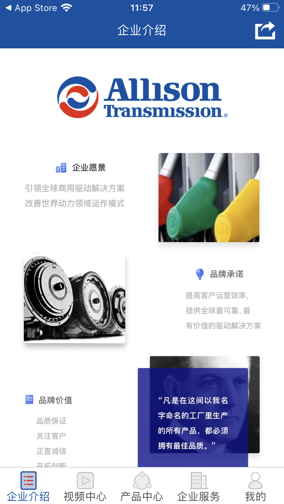
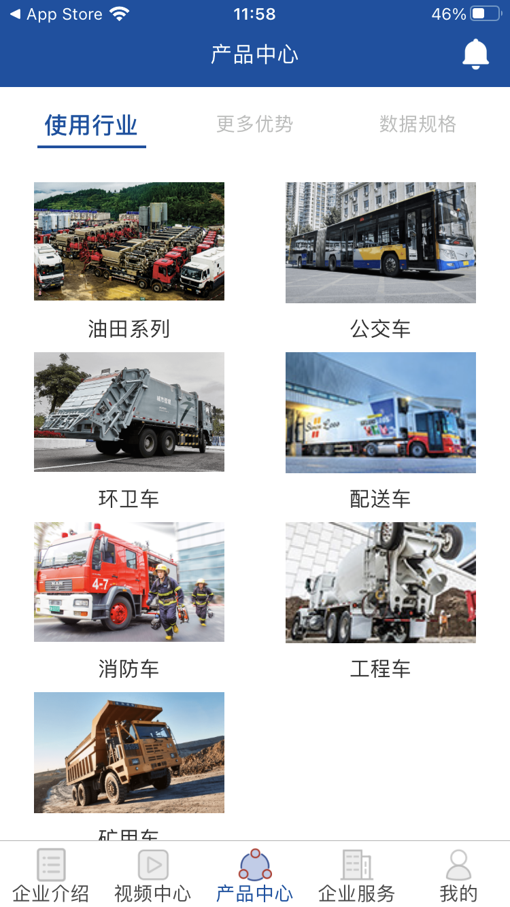

<!--
 * @Author: user.email
 * @Date: 2023-02-09 09:09:44
 * @LastEditors: user.email
 * @LastEditTime: 2023-02-09 14:07:04
 * @FilePath: /react-native-alliosn/README.md
 * @Description: 
 * 
 * Copyright (c) 2023 by hfqf123@126.com, All Rights Reserved. 
-->
# 艾里逊中国

## 介绍
几年前使用rn做的小项目，主体使用react-native+h5嵌套+导入部分原生三方组件。
## 个人体验
1. 跨平台确实香,rn能做绝大部分页面场景
2. 某些场景需要原生开发技能

## 项目截图

